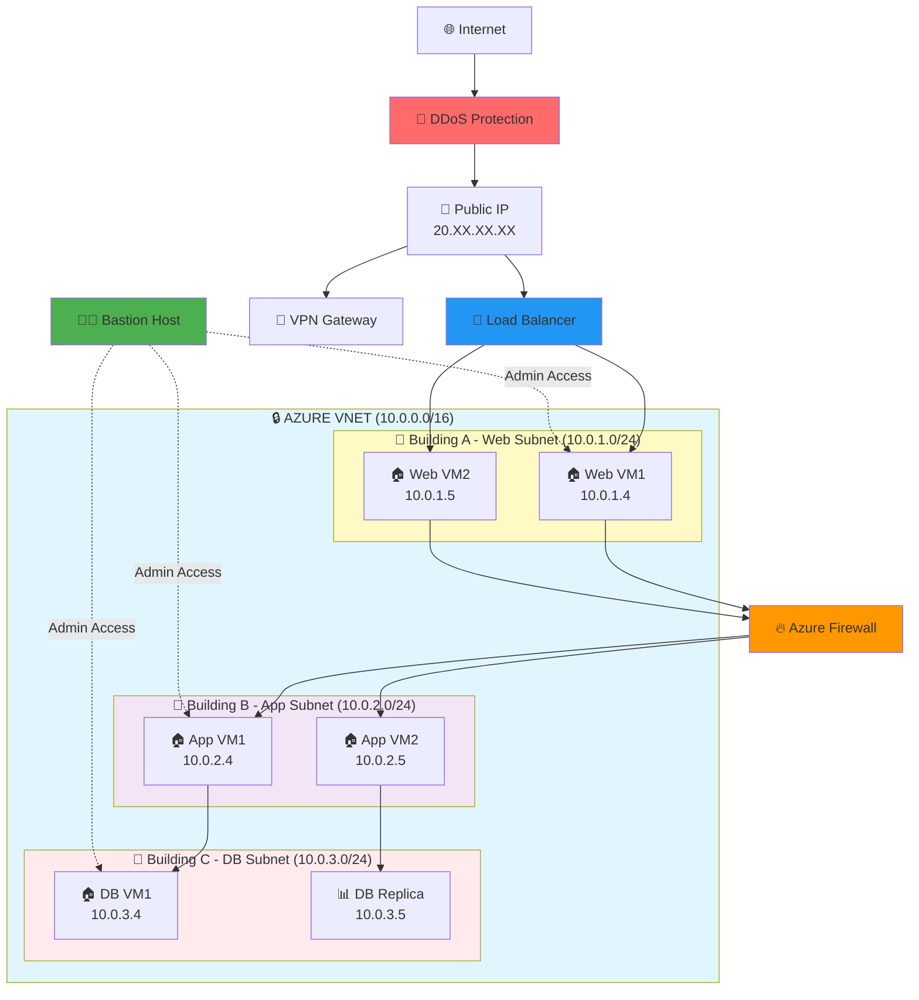
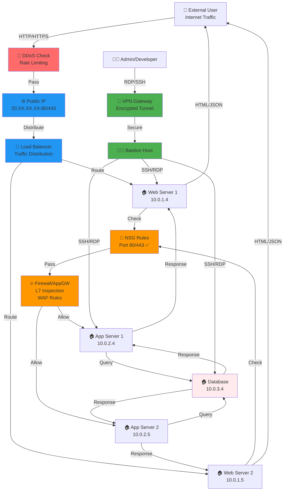
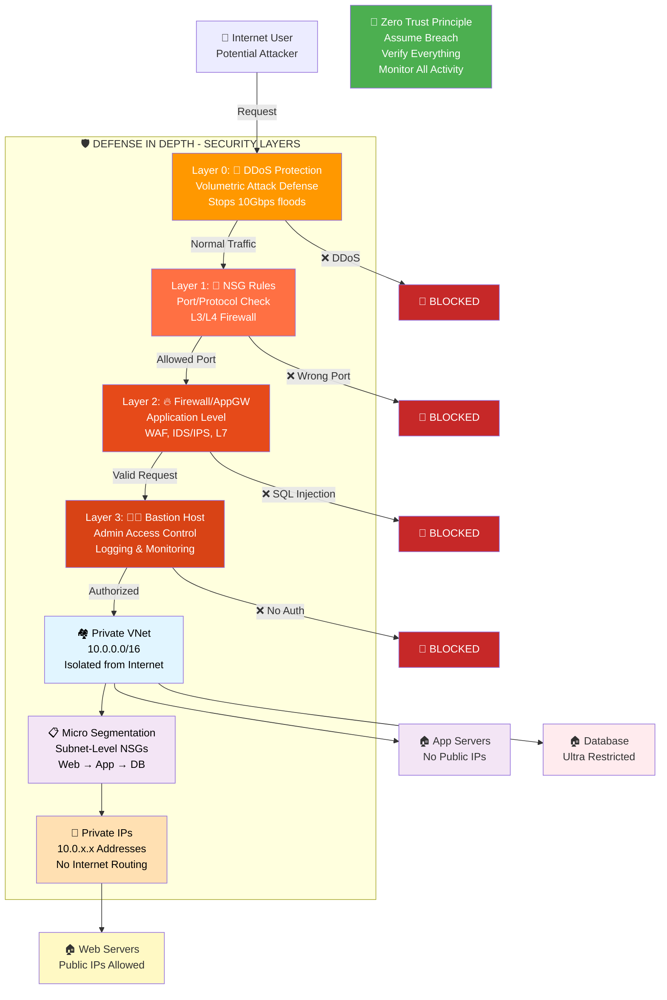
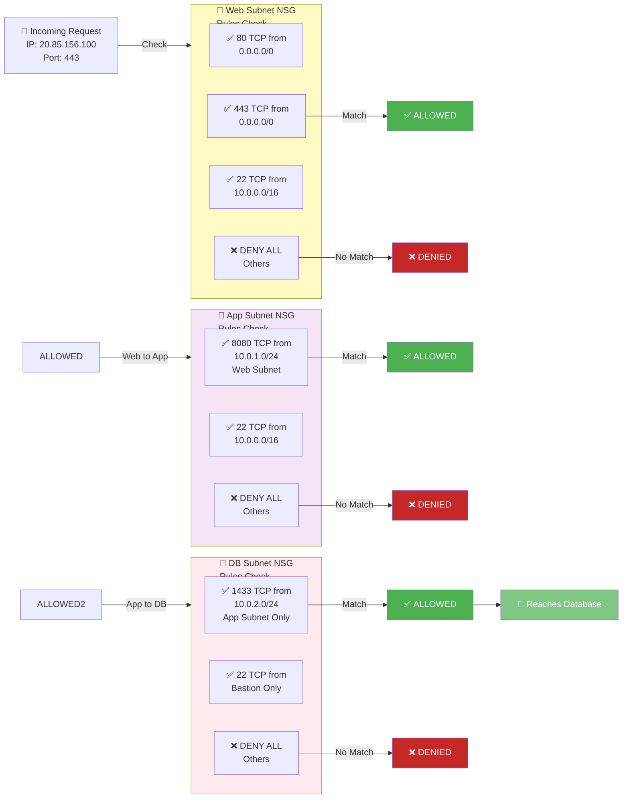
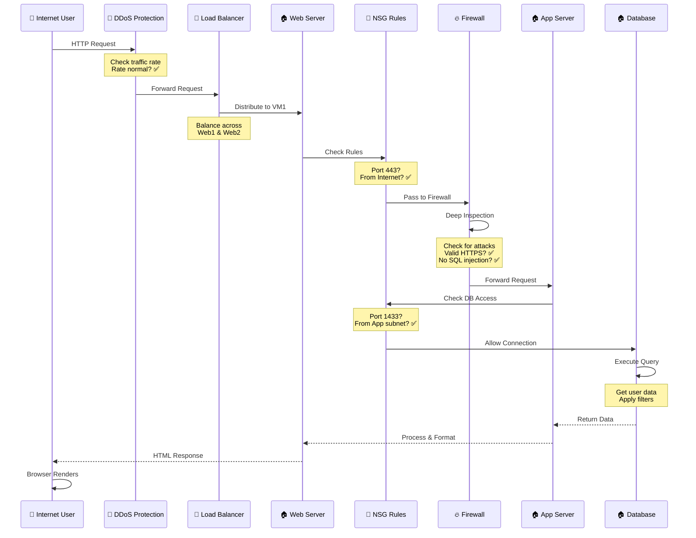
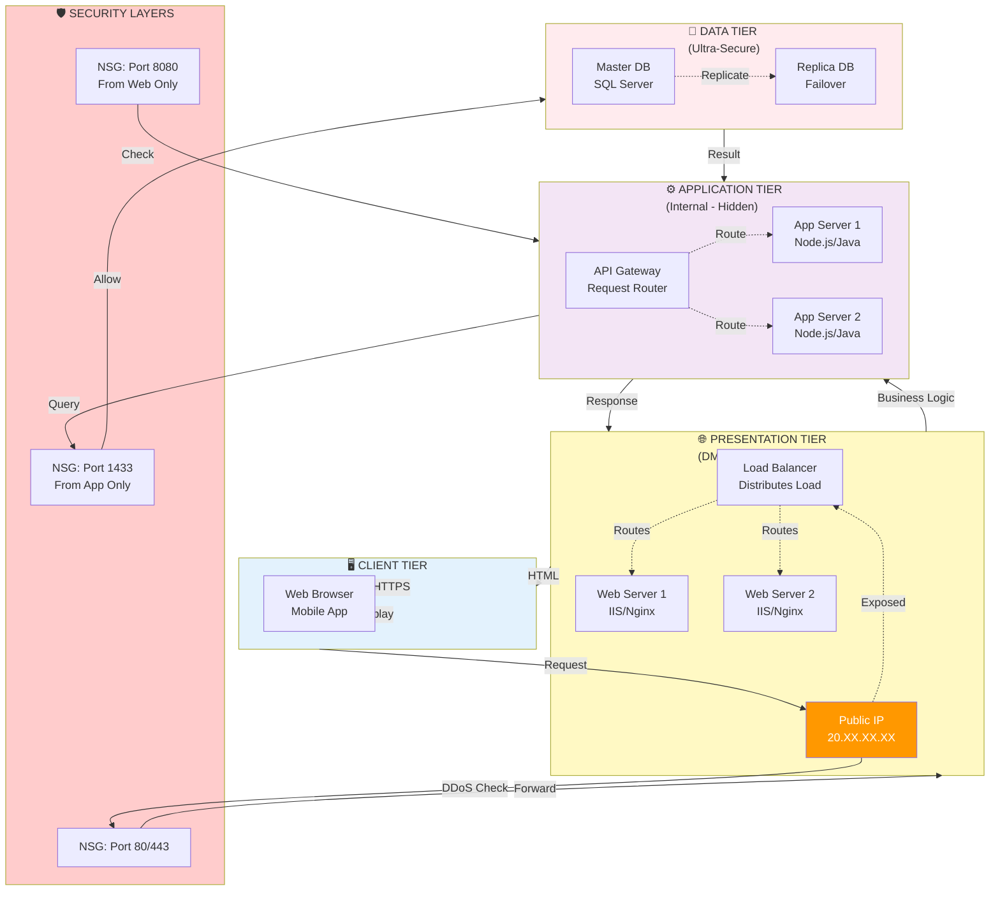

# 🏘️ Azure Networking = Secure Housing Society

---

# 🎨 Mermaid Architecture Diagram



---

# 🌐 Mermaid Traffic Flow Diagram



---

# 🔐 Mermaid Security Layers Diagram



---

# 📊 Mermaid NSG Rules Diagram



---

# 🔄 Mermaid Sequence Diagram - Complete Request Flow



---

# 🏗️ Mermaid 3-Tier Architecture Pattern



---

```
┌─────────────────────────────────────────────────────────────────────────┐
│                     🔒 AZURE VNET (Secure Housing Society)             │
│                                                                         │
│  ┌──────────────────┐  ┌──────────────────┐  ┌──────────────────┐    │
│  │ 🏢 Building A    │  │ 🏢 Building B    │  │ 🏢 Building C    │    │
│  │ (Web Subnet)     │  │ (App Subnet)     │  │ (DB Subnet)      │    │
│  │                  │  │                  │  │                  │    │
│  │ ┌──────────────┐ │  │ ┌──────────────┐ │  │ ┌──────────────┐ │    │
│  │ │ 🏠 VM1       │ │  │ │ 🏠 VM3       │ │  │ │ 🏠 DB VM     │ │    │
│  │ │ (10.0.1.4)   │ │  │ │ (10.0.2.4)   │ │  │ │ (10.0.3.4)   │ │    │
│  │ └──────────────┘ │  │ └──────────────┘ │  │ └──────────────┘ │    │
│  │ ┌──────────────┐ │  │ ┌──────────────┐ │  │                  │    │
│  │ │ 🏠 VM2       │ │  │ │ 🏠 VM4       │ │  │ ┌──────────────┐ │    │
│  │ │ (10.0.1.5)   │ │  │ │ (10.0.2.5)   │ │  │ │ 📊 Replica   │ │    │
│  │ └──────────────┘ │  │ └──────────────┘ │  │ │ (10.0.3.5)   │ │    │
│  │                  │  │                  │  │ └──────────────┘ │    │
│  └──────────────────┘  └──────────────────┘  └──────────────────┘    │
│         ▲                     ▲                       ▲                │
│         │ NSG Rules           │ NSG Rules            │ NSG Rules      │
│         │ (Guard)             │ (Guard)              │ (Guard)        │
│         └─────────────────────┴───────────────────────┘                │
│                               │                                       │
│  ┌────────────────────────────────────────────────────┐               │
│  │   🛑 NSG (Main Security Rules)                     │               │
│  │  Allow HTTP/HTTPS In                              │               │
│  │  Allow Inter-subnet communication                 │               │
│  │  Deny everything else                             │               │
│  └────────────────────────────────────────────────────┘               │
│                               │                                       │
│  ┌────────────────────────────────────────────────────┐               │
│  │   🔥 Azure Firewall (Deep Inspection)              │               │
│  │   Checks all traffic rules, DDoS, threats         │               │
│  └────────────────────────────────────────────────────┘               │
│                               │                                       │
└───────────────────────────────┼───────────────────────────────────────┘
                                │
                    ┌───────────┴───────────┐
                    │                       │
            ┌───────▼────────┐     ┌───────▼────────┐
            │  🚪 Public IP  │     │ 🔐 VPN Gateway │
            │(Main Gate)     │     │ (Private Tunnel)
            │ 20.XX.XX.XX    │     │ (Trusted Entry)
            └────────────────┘     └────────────────┘
                    │                       │
                    │        ┌──────────────┘
                    │        │
            ┌───────▼────────▼──────┐
            │   🚦 Load Balancer    │
            │ (Traffic Distribution)│
            └───────┬────────┬──────┘
                    │        │
        ┌───────────┘        └───────────┐
        │                                │
    From Web              From External
    Visitors              Connections

┌─────────────────────────────────────────┐
│    🧑‍✈️ BASTION HOST                      │
│  (Secure Management Access)             │
│  - No Public IP on VMs                  │
│  - RDP/SSH through Bastion only         │
│  - All connections logged               │
└─────────────────────────────────────────┘

┌─────────────────────────────────────────┐
│    🚨 DDoS PROTECTION                   │
│  (Crowd Control - Stops bulk attacks)  │
└─────────────────────────────────────────┘
```

## 📝 Architecture Explanation

### **🔒 VNet (Virtual Network) - The Society Boundary**
- **What:** A private network space isolated from the internet (10.0.0.0/16)
- **Why:** Keeps all your resources protected by default. No one from outside can access without permission
- **Real World:** Like a gated community with high walls - only authorized people/traffic can enter

### **🏢 Subnets - The Buildings**
- **Building A (Web Subnet - 10.0.1.0/24):** Hosts web servers visible to internet
- **Building B (App Subnet - 10.0.2.0/24):** Hosts application servers (hidden from internet)
- **Building C (DB Subnet - 10.0.3.0/24):** Hosts databases (most restricted)
- **Why:** Separates concerns - different security rules for each tier
- **Real World:** Different buildings in the society for different purposes - visitors only go to main building

### **🏠 VMs (Virtual Machines) - The Flats**
- Each building has VMs with Private IPs (10.0.1.4, 10.0.2.4, etc.)
- Private IPs = internal communication only
- Only Web tier has Public IP (visible to internet)
- **Real World:** Individual apartments with apartment numbers (private) vs gate address (public)

### **🛑 NSG - The Security Guards**
- Rules at subnet level: "Allow port 80/443", "Allow port 1433 only from App subnet"
- Each building has its own guard with different rules
- **Real World:** Different security protocols for each building

### **🌐 Entry Points**
- **Public IP:** Main gate for visitors
- **VPN Gateway:** Private tunnel for staff
- **Load Balancer:** Directs traffic to correct VM
- **Real World:** Visitors use main gate, staff uses back entrance

### **🔥 Azure Firewall - Deep Inspection**
- Checks not just the port, but the entire packet content
- Detects attacks, malware, anomalies
- **Real World:** Like airport security - not just checking ID, but bags too

### **🧑‍✈️ Bastion Host - Secure Management**
- Allows admin access to VMs without exposing them to internet
- All connections go through Bastion (logged and monitored)
- VMs don't need public IPs
- **Real World:** Single entry point for security staff to manage buildings

### **🚨 DDoS Protection - Crowd Control**
- Stops massive traffic floods (like 1 million simultaneous visitors)
- Redirects suspicious traffic
- **Real World:** Blocks large crowds trying to overwhelm the gate

---

# 🧠 Full Mapping (Azure → Real World)

| Azure Concept           | Society Example         | Explanation                            |
| ----------------------- | ----------------------- | -------------------------------------- |
| **VNet**                | 🏘️ Society Boundary    | Entire gated society (private network) |
| **Subnet**              | 🏢 Buildings (A, B, C)  | Separate areas for different purposes  |
| **VM (Server)**         | 🏠 Flats/Rooms          | Where people (apps) live               |
| **Public IP**           | 🚪 Main Gate Address    | Entry point from outside world         |
| **Private IP**          | 🏠 Flat Number          | Internal communication                 |
| **NSG**                 | 🛑 Security Guard Rules | Who can enter/exit                     |
| **Load Balancer**       | 🚦 Traffic Manager      | Distributes visitors                   |
| **Application Gateway** | 🎯 Smart Gate           | Checks type of visitor (HTTP/HTTPS)    |
| **Firewall**            | 🔥 High Security Check  | Deep inspection of visitors            |
| **VPN Gateway**         | 🔐 Private Tunnel       | Secure entry for trusted people        |
| **Bastion**             | 🧑‍✈️ Security Cabin    | Secure access without exposing inside  |
| **DDoS Protection**     | 🚨 Crowd Control        | Stops attack/too many visitors         |

---

# 🌐 Traffic Flow Diagram (How Data Moves)

```
EXTERNAL VISITOR (Internet Traffic)
         │
         │ HTTP/HTTPS Request
         ▼
    ┌─────────────┐
    │ DDoS Check  │  ← Stops massive attacks
    │ (Threshold) │
    └──────┬──────┘
           │
           ▼
    ┌─────────────────────────┐
    │  Public IP (Gate)       │  ← Entry Point
    │  20.XX.XX.XX:80/443     │
    └──────┬──────────────────┘
           │
           ▼
    ┌────────────────────────┐
    │ Load Balancer          │  ← Distributes Traffic
    │ (Traffic Cop)          │
    └──┬───────────┬─────────┘
       │           │
       ▼           ▼
  ┌────────┐  ┌────────┐
  │  VM1   │  │  VM2   │  ← Web Servers (Building A)
  │10.0.1.4│  │10.0.1.5│
  └────────┘  └────────┘
       │           │
       └─────┬─────┘
           ▼
    ┌─────────────────────────┐
    │  NSG Rules Check        │  ← Security Guard
    │  (Allow/Deny)           │
    └──────┬──────────────────┘
           │
           ▼
    ┌────────────────────────────┐
    │ Application Gateway/        │  ← Smart Gate
    │ Firewall (Deep Inspection)  │  (Protocol check, WAF rules)
    └──────┬─────────────────────┘
           │
           ▼
    ┌────────────────────────────┐
    │ Application Layer          │   ← Inside Society
    │ (App Servers)              │   (Building B)
    │ 10.0.2.4 / 10.0.2.5        │
    └────────┬───────────────────┘
             │
             ▼
    ┌────────────────────────────┐
    │ Database Layer             │   ← Inside Society
    │ (Building C)               │   (Only other servers)
    │ 10.0.3.4 / 10.0.3.5        │
    └────────────────────────────┘


INTERNAL TRAFFIC (Building-to-Building):
VNet Internal → NSG Check → Direct (No Public IP needed)

VPN TUNNEL (Trusted Remote Office):
Remote Office → VPN Gateway → Private Tunnel → Inside VNet
```

## 📡 Traffic Flow Explanation

### **Why is this flow important?**
This shows exactly how data travels through your Azure infrastructure and where each security checkpoint happens.

### **Step-by-Step Breakdown:**

1. **🚨 DDoS Check (First Defense)**
   - **What happens:** Traffic is checked against DDoS threshold limits
   - **Protection:** Stops billion-packet attacks before they overwhelm your system
   - **Example:** If 1M requests/sec arrive (abnormal), they're redirected or blocked
   - **Real World:** Like the gate checking if too many people are trying to enter

2. **🌐 Public IP - Main Gate**
   - **What happens:** Visitor traffic hits the public-facing address (20.XX.XX.XX)
   - **Who needs it:** Only Web tier servers. App & DB servers stay hidden
   - **Security benefit:** Keeps internal infrastructure invisible to attackers
   - **Real World:** Only the main gate is visible to the outside world

3. **🚦 Load Balancer - Traffic Cop**
   - **What happens:** Distributes incoming traffic across multiple VM instances
   - **Why it matters:** Prevents single VM overload, improves performance
   - **Example:** 1000 visitors → 500 to VM1, 500 to VM2
   - **Real World:** Reception desk directing visitors to available rooms

4. **Web Servers (Building A - 10.0.1.4 / 10.0.1.5)**
   - **What they do:** Process HTTP/HTTPS requests, serve web content
   - **Public visibility:** YES - they have public IPs
   - **Role:** First touch point for customer requests
   - **Real World:** Main lobby of the society

5. **🛑 NSG Rules Check - Security Guard**
   - **What happens:** Checks if traffic is allowed based on rules
   - **Rules example:** "Only allow port 80/443 from anywhere" for Web subnet
   - **Deep dive:** Layer 4 (Transport) security - checks ports & protocols
   - **Real World:** Guard checks visitor passes

6. **🔥 Application Gateway / Firewall - Smart Gate**
   - **What happens:** Layer 7 (Application) inspection
   - **Checks:** 
     - Is it valid HTTP/HTTPS?
     - Any known attack patterns?
     - DDoS at application level?
   - **Blocks:** Malicious payloads, SQL injections, XSS attacks
   - **Real World:** Security officer checking bags, IDs thoroughly

7. **App Servers (Building B - 10.0.2.4 / 10.0.2.5)**
   - **What they do:** Core business logic, process requests
   - **Public visibility:** NO - these are hidden, only accessible from Web tier
   - **Security benefit:** Attackers can't reach app servers directly
   - **Real World:** Internal office areas - only staff can enter

8. **Database Layer (Building C - 10.0.3.4 / 10.0.3.5)**
   - **What they do:** Store and manage data
   - **Public visibility:** ABSOLUTELY NOT - most restricted
   - **Access:** Only from App servers on port 1433
   - **Real World:** Vault - most secure part of the society

### **Two-Way Communication:**
- **Outbound:** App → Load Balancer → Internet (for external API calls)
- **Inbound:** Internet → Load Balancer → Web → App → DB

### **VPN Tunnel (Trusted Remote Office):**
- **Use case:** Remote office staff need access to internal systems
- **Path:** Remote Office VPN Client → VPN Gateway → Inside VNet (encrypted)
- **Security:** End-to-end encryption, only trusted networks
- **Real World:** Secret back entrance for trusted staff

---

# 🏗️ Step-by-Step Flow (Real Understanding)

### 1️⃣ Society (VNet)

* Entire secure area
* Only authorized access

---

### 2️⃣ Buildings (Subnets)

* Example:

  * Building A → Web servers
  * Building B → App servers
  * Building C → Database

---

### 3️⃣ Entry Gate (Public IP)

* Visitors enter through main gate

---

### 4️⃣ Security Guard (NSG)

* Rules:

  * Allow residents
  * Block unknown people

---

### 5️⃣ Smart Routing (Load Balancer)

* Distributes visitors to different flats (servers)

---

### 6️⃣ Advanced Security (Firewall)

* Checks bags, identity (deep inspection)

---

### 7️⃣ Private Entry (VPN)

* Trusted people enter securely (like staff entry)

---

### 8️⃣ Secure Internal Movement

* Inside society → people move freely (private IPs)

---

# 🔐 Security Layers Diagram (Defense in Depth)

```
                    OUTER PERIMETER
                        
                    🚨 DDoS Protection
                    (Stops Floods)
                         ▲
                         │
                    🌐 Public IP
                    (Gate Address)
                         ▲
                         │
                 ┌────────┴────────┐
                 │                 │
        🚦 Load  │         🔐 VPN  │
        Balancer │        Gateway  │
                 │                 │
                 └────────┬────────┘
                         ▲
                    FIRST LAYER
                    
                 🛑 NSG (Network Security Group)
              (Allow/Block by port & protocol)
              
                         ▲
                    SECOND LAYER
                    
        🔥 Azure Firewall / Application Gateway
              (Stateful inspection, WAF rules)
              
                         ▲
                    THIRD LAYER
              
         🧑‍✈️ Bastion Host (Management)
        (Secure access to VMs without Public IP)
        
                         ▲
                    INSIDE VNET
                    
        🏘️ VNet Boundary (Private Address Space)
        10.0.0.0/16 - Only internal access
        
                         ▲
                    INSIDE VNET
                    
    ┌─────────────┬─────────────┬─────────────┐
    │ Subnet A    │ Subnet B    │ Subnet C    │
    │ (10.0.1.0)  │ (10.0.2.0)  │ (10.0.3.0)  │
    │ Web Layer   │ App Layer   │ Data Layer  │
    │              │              │              
    │ 🏠 VMs      │ 🏠 VMs      │ 🏠 DB VMs   │
    │ Public IP   │ No Public IP│ No Public IP│
    │ NSG: 80,443 │ NSG: 8080   │ NSG: 1433   │
    └─────────────┴─────────────┴─────────────┘


KEY PRINCIPLE: 🔑 Zero Trust + Defense in Depth
- Assume breach at every layer
- Verify every request
- Limit access to minimum needed
- Monitor all activity
```

## 🎯 Security Layers Explanation

### **Why Multiple Layers? (Defense in Depth Strategy)**
If one layer fails, the next layer catches the attack. It's like multiple security checkpoints:
- Attackers have to break through ALL layers to succeed
- Each layer provides different type of protection
- Single point of failure is avoided

### **Layer-by-Layer Breakdown:**

#### **Layer 0: 🚨 DDoS Protection (Outermost)**
- **What it protects against:** Volumetric attacks (millions of requests)
- **How:** Azure's scrubbing centers filter traffic, only legitimate traffic passes
- **Example:** 10 Gbps of garbage traffic comes in → Only 1 Gbps of real traffic reaches your system
- **Cost:** Usually included in Standard/Premium DDoS Protection plan
- **Real World:** Metal detectors at society gate blocking unauthorized entries

---

#### **Layer 1: 🛑 NSG (Network Security Group)**
- **What it protects against:** Unauthorized port/protocol access
- **How it works:** Creates firewall rules at subnet level
- **Example rules:**
  ```
  Allow: Inbound 80 (HTTP) from 0.0.0.0/0 (anywhere)
  Allow: Inbound 443 (HTTPS) from 0.0.0.0/0 (anywhere)
  Allow: Inbound 3389 (RDP) from 10.0.0.0/16 (internal only)
  Deny: All other traffic (implicit)
  ```
- **Layer:** OSI Layer 3/4 (Network/Transport)
- **Real World:** Guard checking visitor passes, allowing only registered guests

---

#### **Layer 2: 🔥 Azure Firewall / Application Gateway**
- **What it protects against:** Application-level attacks
- **How it works:** Deep packet inspection, WAF (Web Application Firewall) rules
- **Detects:**
  - SQL Injection attacks
  - Cross-Site Scripting (XSS)
  - Command injection
  - Malformed requests
- **Layer:** OSI Layer 7 (Application)
- **Example:**
  ```
  Request: "search.php?id=1' OR '1'='1"  → BLOCKED (SQL Injection)
  Request: "search.php?id=123"           → ALLOWED (Safe)
  ```
- **Real World:** Security officer reading every document to detect counterfeits

---

#### **Layer 3: 🧑‍✈️ Bastion Host (Management Access)**
- **What it protects against:** Direct administrative access to VMs from internet
- **How it works:** All admin connections tunnel through Bastion
- **Benefits:**
  - VMs don't need public IPs
  - All admin activity is logged
  - Centralized access control
  - Removes attack surface
- **Real World:** Single administrative office where managers can manage buildings remotely

---

#### **Inside VNet: 🏘️ Private Address Space**
- **What it protects:** Internal communication is isolated from internet
- **How it works:** By default, all traffic inside VNet is allowed (additional NSGs can restrict)
- **Addresses:** 10.0.0.0/16 - no internet can route these
- **Real World:** Inside the gated society - people can move freely between buildings

---

#### **Subnets: 📋 Micro-segmentation**
- **What it protects:** Limits lateral movement if one server is breached
- **Examples:**
  - If Web server is hacked → Can only reach App servers (not DB)
  - If App server is compromised → Can't directly access other Web servers
- **NSG per subnet:** Each building has its own security rules
- **Real World:** Locked doors between departments - staff in one building can't easily reach sensitive areas

---

### **Attack Scenario (How Layers Work Together):**

```
Attacker attempts SQL Injection attack:

1. ✅ DDoS Layer: 🚨 Passes (normal traffic rate)
2. ✅ NSG Layer: 🛑 Passes (allowed port 443)
3. ❌ Firewall Layer: 🔥 BLOCKED! "' OR '1'='1" detected as SQL injection
   → Attack stopped, attacker never reaches application code
   → Log created with attacker IP (20.XX.XX.XX)
   → Alert sent to security team
```

---

### **Zero Trust Principle:**
- 🚫 Don't trust traffic just because it's internal
- 🔍 Verify every request at every layer
- 🔐 Use MFA for admin access via Bastion
- 📊 Monitor and log everything
- ⏱️ Regular security audits and penetration testing

---

# 🔐 Security Levels (Important 🔥)

| Level    | Society Example      | Azure    |
| -------- | -------------------- | -------- |
| Basic    | Gate + guard         | NSG      |
| Advanced | CCTV + strict check  | Firewall |
| High     | Private entry tunnel | VPN      |

---

# 🎯 Interview One-Liner

👉 **Azure VNet is like a gated society where subnets are buildings, NSGs are security guards, and services like load balancer and firewall manage traffic and security.**

---

# 🚀 Quick Memory Trick

```
VNet = Society  
Subnet = Building  
VM = Flat  
NSG = Security Guard  
Public IP = Gate  
```

---

# 💡 Real-World Configuration Example

## **Scenario:** E-commerce Website

```yaml
🏘️ VNet: 10.0.0.0/16 (company.internal)

├─ 🏢 Building A - Web Layer (10.0.1.0/24)
│  ├─ 🏠 VM1: nginx/IIS - Web Server 1 (10.0.1.4)
│  ├─ 🏠 VM2: nginx/IIS - Web Server 2 (10.0.1.5)
│  ├─ Public IP: 20.85.156.100 (company.com)
│  └─ NSG Rules:
│     ✅ Inbound 80 (HTTP) from 0.0.0.0/0
│     ✅ Inbound 443 (HTTPS) from 0.0.0.0/0
│     ✅ Inbound 22 (SSH) from 10.0.0.0/16 only
│     ❌ All else DENY

├─ 🏢 Building B - App Layer (10.0.2.0/24)
│  ├─ 🏠 VM3: Node.js/Java App Server (10.0.2.4)
│  ├─ 🏠 VM4: Node.js/Java App Server (10.0.2.5)
│  ├─ NO Public IP (hidden from internet)
│  └─ NSG Rules:
│     ✅ Inbound 8080 from 10.0.1.0/24 (Web tier only)
│     ✅ Inbound 22 (SSH) from 10.0.0.0/16 only
│     ❌ All else DENY

└─ 🏢 Building C - Data Layer (10.0.3.0/24)
   ├─ 🏠 VM5: SQL Server (10.0.3.4)
   ├─ 🏠 VM6: SQL Server Replica (10.0.3.5)
   ├─ NO Public IP (ultra-restricted)
   └─ NSG Rules:
      ✅ Inbound 1433 from 10.0.2.0/24 (App tier only)
      ✅ Inbound 22 (SSH) from Bastion only
      ❌ ALL other traffic DENY
      (No internet access whatsoever)
```

### **Traffic Path Examples:**

**5️⃣ Customer browsing website:**
```
Internet User → 🌐 Public IP (20.85.156.100)
→ 🚦 Load Balancer → 🛑 NSG (Port 443 check)
→ 🔥 Firewall (SSL/TLS check)
→ 🏠 Web VM1 or VM2 (serve content)
```

**6️⃣ Web server calling backend API:**
```
🏠 Web VM (10.0.1.4) → 🛑 NSG Check (Port 8080 from Web subnet OK)
→ 🏠 App VM (10.0.2.4) → Process request
```

**7️⃣ App server querying database:**
```
🏠 App VM (10.0.2.4) → 🛑 NSG Check (Port 1433 from App subnet OK)
→ 🏠 Database VM (10.0.3.4) → Query executed
```

**8️⃣ Admin managing database:**
```
🖥️ Admin PC (outside) → 🔐 VPN Gateway (creates encrypted tunnel)
→ 💻 Bastion Host (10.0.0.X) → 🏠 DB VM (10.0.3.4)
→ Execute commands (everything logged)
```

---

# 🎓 Key Takeaways for Interview

| Question | Answer |
|----------|--------|
| **What is a VNet?** | A private, isolated network in Azure. Like a walled city where resources communicate safely |
| **Why subnets?** | To segment workloads. Web servers publicly visible, app servers hidden, databases ultra-restricted |
| **Purpose of NSG?** | First firewall. Allows/blocks traffic by port and protocol. One per subnet minimum |
| **When use Firewall?** | For advanced threats, DDoS, application-level attacks. NSG is not enough for production |
| **What is Bastion?** | Secure jump host for admin access. VMs don't need public IPs. All activity logged |
| **Defense in Depth?** | Multiple security layers. If one fails, others still protect. Standard practice |
| **Public IP usage?** | Only on Web tier. App/DB tiers stay hidden = smaller attack surface |
| **VPN Gateway purpose?** | Secure tunnel for remote access. Encrypts all traffic between office and Azure |

---

# ⚠️ Common Mistakes to Avoid

| Mistake | Impact | Solution |
|---------|--------|----------|
| Putting all VMs in single subnet | No micro-segmentation, breach affects all | Create separate subnets per tier |
| NSG allowing all traffic (0.0.0.0/0) | Same as no security | Restrict to specific subnets/ports |
| Public IP on database VMs | Attackers can attack DB directly | Remove public IPs from sensitive tiers |
| Forgetting Bastion setup | Need public IPs everywhere | Use Bastion for admin access |
| No DDoS protection | Vulnerable to DoS attacks | Enable DDoS Standard at minimum |
| Firewall = NSG | No App-layer protection | Use both: NSG (L3/4) + Firewall (L7) |
| Not monitoring logs | Breaches go undetected | Enable Azure Monitor, Log Analytics |

---
